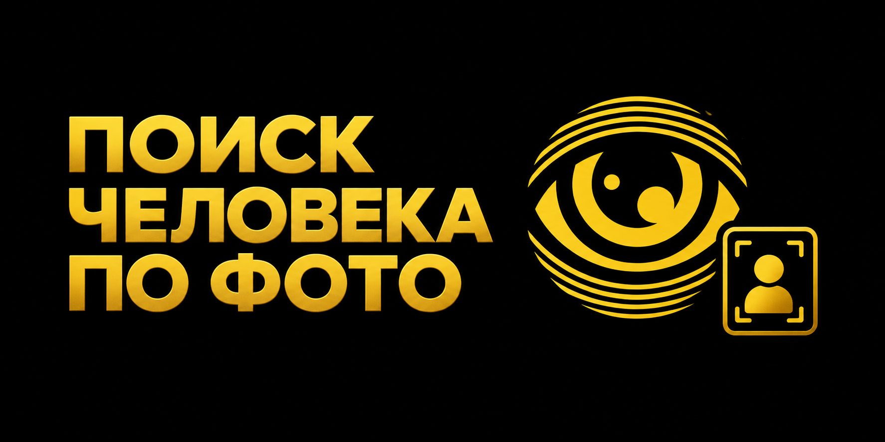

# Поиск человека по фото: простая инструкция

> Обновлено: **22 сентября 2026 года** · Автор: **редакция ProbivTG** · Объясняем простыми словами

Поиск человека по фото работает как поиск копий и похожих изображений в открытом интернете. Он может привести к открытому профилю, публикации, объявлению или странице, где снимок использовался раньше. Это не автоматическое доказательство личности: одинаковую фотографию копируют, обрезают, зеркалят и используют в чужих аккаунтах.

<a href="https://probivtg.pro/?utm_source=github&utm_medium=organic&utm_campaign=glaz-boga-poisk-bot&utm_content=poisk-cheloveka-po-foto&utm_term=top&ref=github_glaz-boga-poisk-bot_poisk-cheloveka-po-foto"><strong>Пробив бот — открыть сервис</strong></a>

## Как подготовить изображение

Используйте исходный файл максимально доступного качества. Сделайте отдельные версии: полный кадр, аккуратный фрагмент лица, фон или уникальный объект. Уберите рамки и подписи, которые мешают сравнению. Проверьте как обычную, так и зеркальную версию. Если снимок содержит других людей, не делайте вывод о владельце страницы только по групповому кадру.

Результат может показать страницы с этой фотографией, похожие изображения, ники, подписи, город, дату публикации и связанные открытые контакты. Email, телефон или адрес появляются лишь тогда, когда они открыто указаны на найденной странице.

<a href="https://probivtg.pro/?utm_source=github&utm_medium=organic&utm_campaign=glaz-boga-poisk-bot&utm_content=poisk-cheloveka-po-foto&utm_term=middle&ref=github_glaz-boga-poisk-bot_poisk-cheloveka-po-foto"><strong>Пробив TG — проверить исходные данные</strong></a>

## Как проверить найденную фотографию

Откройте первоисточник, а не только миниатюру. Сравните дату, подпись, имя профиля, другие фотографии и внешние ссылки. Старое фото может быть связано с прежней фамилией или ником. Если изображение встречается в десятках несвязанных аккаунтов, вероятен фейк или массовое копирование. Если совпадают фото, ник и порядок публикаций по датам, связь выглядит убедительнее, но всё равно требует ещё одной проверки.

Не используйте визуальное сходство как точное подтверждение личности. Поиск помогает найти страницу со снимком, а не установить личность со стопроцентной точностью.

## Как мы проверяли советы

Советы обновлены 22 сентября 2026 года. Мы проверили полный кадр, обрезанную фотографию и зеркальную копию. Для каждого варианта важен первоисточник, поэтому простое внешнее сходство не считается готовым ответом.

## Как не ошибиться

Одна и та же фотография может появиться на десятках страниц. Её могли скопировать, обрезать или использовать в чужом аккаунте. Откройте страницу, где снимок появился раньше всего. Посмотрите подпись, дату, другие фото и ссылки.

Похожее лицо ещё не доказывает, что это тот же человек. Намного важнее общий контекст: одинаковый ник, тот же город, связанные контакты и понятный порядок публикаций. Не используйте один снимок как единственное доказательство.

## Частые вопросы

### Можно ли найти Telegram по фото?

Иногда фото приводит к открытой странице или открытому Telegram-профилю, но закрытая учётная запись может не индексироваться.

### Почему находятся чужие страницы?

Фотографию могли скопировать, использовать в подборке или поставить на фейковый аккаунт.

### Нужно ли обрезать лицо?

Полезно проверить и полный кадр, и аккуратный фрагмент: разные сервисы находят совпадения по-разному.

## Где прочитать правила

- [Google: поиск по изображению](https://support.google.com/websearch/answer/1325808?hl=ru)
- [Яндекс: поиск по изображению](https://yandex.ru/support/images/ru/search-by-image)

<a href="https://probivtg.pro/?utm_source=github&utm_medium=organic&utm_campaign=glaz-boga-poisk-bot&utm_content=poisk-cheloveka-po-foto&utm_term=bottom&ref=github_glaz-boga-poisk-bot_poisk-cheloveka-po-foto"><strong>Перейти в ProbivTG</strong></a>

Проверяйте свои данные или работайте с согласия человека. Не публикуйте найденные контакты без причины.

